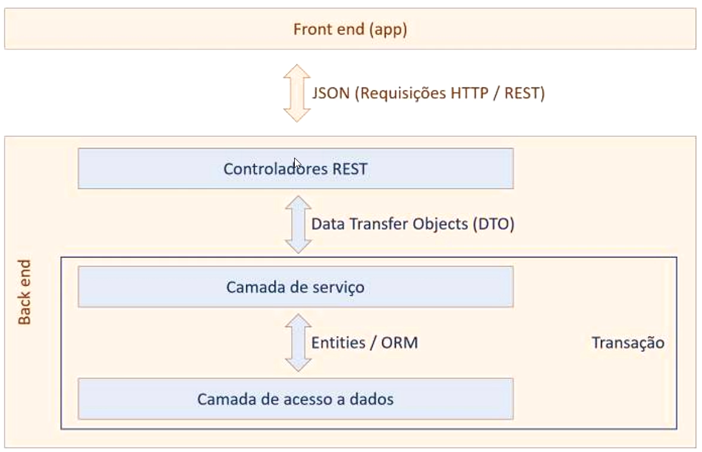

# Crud seguindo a arquitetura REST com DTO.

## Descrição

O api permite tratar requisições GET, POST, PUT e DELETE;

## Tecnologias utilizadas

- Java 17
- Spring Boot
- Spring Data JPA
- Spring Web
- H2 Database
- Maven

## Arquitetura do projeto

<p align="center">
  
</p>

## Endpoints:

**Criar Pessoa:**

- POST [http://localhost:8080/pessoa]

json

```json
{
  "nome": "string",
  "email": "string",
  "dataNasci": "yyyy-MM-dd"
}
```

Resposta: 201 Created

json

```json
{
  "id": 1,
  "nome": "string",
  "email": "string",
  "dataNasci": "yyyy-MM-dd"
}
```

**Atualizar Pessoa:**

Query params:

- id: *Informar o id da pessoa para ser alterado.*

-PUT [http://localhost:8080/pessoa/id]

Request Body:

json

 ```json
{
  "nome": "string",
  "email": "string",
  "dataNasci": "yyyy-MM-dd"
}
```

Resposta: 200 OK

json

```json
{
  "id": 1,
  "nome": "string",
  "email": "string",
  "dataNasci": "yyyy-MM-dd"
}
```

**Buscar pessoa por nome:**

Query params:

- nome: *Informar o nome da pessoa para ser localizado.*

-GET [http://localhost:8080/pessoa/buscaPorNome/nome]

Resposta: 200 OK

json

```json
  [
  {
    "id": 1,
    "nome": "igual",
    "email": "string",
    "dataNasci": "yyyy-MM-dd"
  },
  {
    "id": 2,
    "nome": "nome igual",
    "email": "string",
    "dataNasci": "yyyy-MM-dd"
  }
]
```

**Listar todas as pessoas:**

-GET [http://localhost:8080/pessoa]

Resposta: 200 OK

json

```json
  [
  {
    "id": 1,
    "nome": "string",
    "email": "string",
    "dataNasci": "yyyy-MM-dd"
  },
  {
    "id": 2,
    "nome": "string",
    "email": "string",
    "dataNasci": "yyyy-MM-dd"
  }
]
```
**Deletar uma pessoa por id**

Query params:

- id: *Informar o id da pessoa para ser deletado.*

-DELETE [http://localhost:8080/pessoa/id]

Resposta: No_CONTENT

json

```json
{
  "id": 1,
  "nome": "string",
  "email": "string",
  "dataNasci": "yyyy-MM-dd"
}
```
